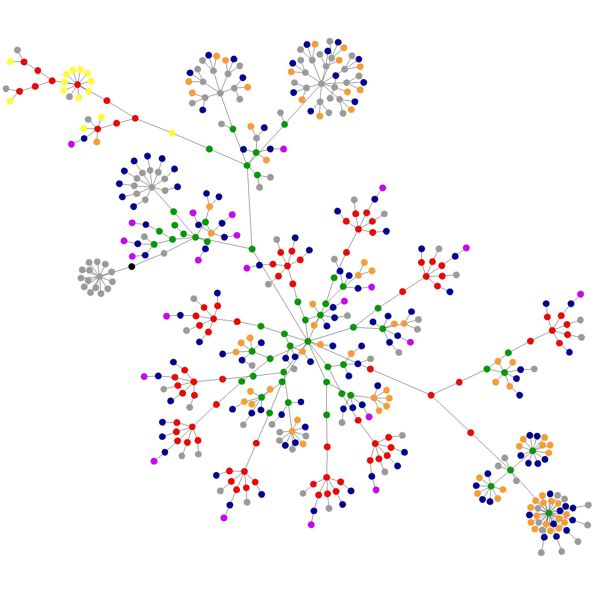

# Programa de Teoría de gráficas

## Integranges del equipo

- Carmona Maldonado Gibrán Isaí.
- Contreras Rojas Emanuel Saúl.
- Guzmán Ramos Carlos Emilio.
- Rodríguez Medina José Alfredo.

## Ejecutar en Windows

Para ejecutar en Windows, es necesario tener los archivos `SDL3.dll` y `LiberationMono-Regular.ttf` en la misma carpeta que el ejecutable del programa

